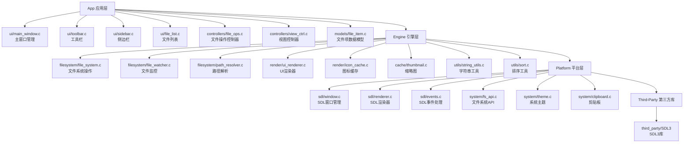

# 项目结构流程图

```mermaid
flowchart TD
    A[App 应用层]
    A1[ui/main_window.c\n主窗口管理]
    A2[ui/toolbar.c\n工具栏]
    A3[ui/sidebar.c\n侧边栏]
    A4[ui/file_list.c\n文件列表]
    A5[controllers/file_ops.c\n文件操作控制器]
    A6[controllers/view_ctrl.c\n视图控制器]
    A7[models/file_item.c\n文件项数据模型]

    B[Engine 引擎层]
    B1[filesystem/file_system.c\n文件系统操作]
    B2[filesystem/file_watcher.c\n文件监控]
    B3[filesystem/path_resolver.c\n路径解析]
    B4[render/ui_renderer.c\nUI渲染器]
    B5[render/icon_cache.c\n图标缓存]
    B6[cache/thumbnail.c\n缩略图]
    B7[utils/string_utils.c\n字符串工具]
    B8[utils/sort.c\n排序工具]

    C[Platform 平台层]
    C1[sdl/window.c\nSDL窗口管理]
    C2[sdl/renderer.c\nSDL渲染器]
    C3[sdl/events.c\nSDL事件处理]
    C4[system/fs_api.c\n文件系统API]
    C5[system/theme.c\n系统主题]
    C6[system/clipboard.c\n剪贴板]

    D[Third-Party 第三方库]
    D1[third_party/SDL3\nSDL3库]

    %% 层级关系
    A --> B
    B --> C
    C --> D

    %% 细分模块
    A --> A1
    A --> A2
    A --> A3
    A --> A4
    A --> A5
    A --> A6
    A --> A7

    B --> B1
    B --> B2
    B --> B3
    B --> B4
    B --> B5
    B --> B6
    B --> B7
    B --> B8

    C --> C1
    C --> C2
    C --> C3
    C --> C4
    C --> C5
    C --> C6

    D --> D1
```

---

> 本流程图展示了项目的分层结构及主要模块依赖关系。每一层都只依赖于下层，便于维护和扩展。 