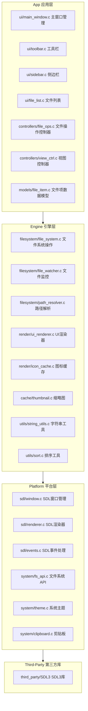

# 项目结构流程图

```mermaid
flowchart TD
    subgraph App[App 应用层]
        A1[ui/main_window.c 主窗口管理]
        A2[ui/toolbar.c 工具栏]
        A3[ui/sidebar.c 侧边栏]
        A4[ui/file_list.c 文件列表]
        A5[controllers/file_ops.c 文件操作控制器]
        A6[controllers/view_ctrl.c 视图控制器]
        A7[models/file_item.c 文件项数据模型]
    end

    subgraph Engine[Engine 引擎层]
        B1[filesystem/file_system.c 文件系统操作]
        B2[filesystem/file_watcher.c 文件监控]
        B3[filesystem/path_resolver.c 路径解析]
        B4[render/ui_renderer.c UI渲染器]
        B5[render/icon_cache.c 图标缓存]
        B6[cache/thumbnail.c 缩略图]
        B7[utils/string_utils.c 字符串工具]
        B8[utils/sort.c 排序工具]
    end

    subgraph Platform[Platform 平台层]
        C1[sdl/window.c SDL窗口管理]
        C2[sdl/renderer.c SDL渲染器]
        C3[sdl/events.c SDL事件处理]
        C4[system/fs_api.c 文件系统API]
        C5[system/theme.c 系统主题]
        C6[system/clipboard.c 剪贴板]
    end

    subgraph ThirdParty[Third-Party 第三方库]
        D1[third_party/SDL3 SDL3库]
    end

    App --> Engine
    Engine --> Platform
    Platform --> ThirdParty
```

---

> 本流程图用子图清晰表达了各层的模块归属和依赖关系。每一层只依赖下层，结构清晰，便于维护和扩展。 